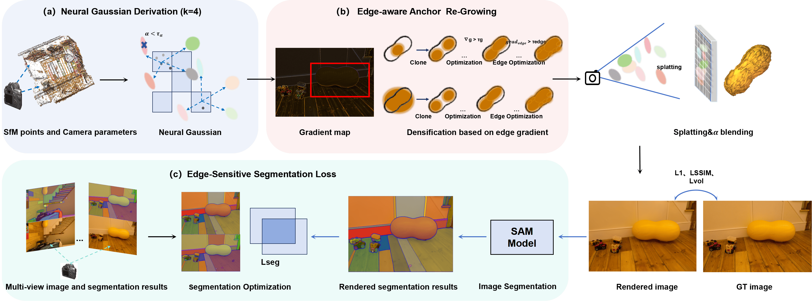

# Enhancing Boundary Fidelity in 3D Scene Rendering via Edge-Aware Gaussian Splatting

Mengyi Wang<sup>1</sup>, Beiqi Chen<sup>1</sup>, Niansheng Liu<sup>1</sup>, Shuting Chen<sup>2</sup>, Jinhe Su<sup>1*</sup>  
<sup>1</sup> The School of Computer Engineering, Jimei University, Xiamen, Fujian, China  
<sup>2</sup> Chengyi College, Jimei University, Xiamen, Fujian, China  

[[`Project Page`](https://github.com/Mazycity57/Edge-GS)] | [](https://link.to/your/paper)


## Abstract  
Recent advancements in 3D Gaussian-based scene rendering have shown significant potential for efficient neural scene representation. However, accurately capturing geometric boundaries and fine details in complex scenes remains challenging. This paper introduces a novel method that addresses these challenges by dynamically increasing neural Gaussian density in high-gradient regions using edge-aware optimization and leveraging the Segment Anything Model (SAM) for accurate object segmentation. Our collaborative optimization strategy significantly enhances boundary clarity and texture fidelity in 3D Gaussian rendering, particularly in complex scenes. Evaluated on multiple datasets, our method demonstrates substantial improvements in rendering quality, achieving a 0.23 improvement in PSNR on the Tanks&Temples dataset compared to the baseline method.
---

## Key Features  
- **Edge-aware Anchor Re-Growing**: Dynamically increases Gaussian density in high-gradient regions using image-space gradients and multi-round optimization.  
- **SAM-guided Segmentation Loss**: Integrates semantic segmentation masks from SAM to refine boundary alignment and reduce artifacts.  
- **Multi-dataset Superiority**: Outperforms existing methods (e.g., 3DGS, Scaffold-GS) on Tanks&Temples, Mip-NeRF360, and DeepBlending datasets.  

---

## Method Overview  
<p align="center">
  
</p>  

**Edge-GS** consists of three modules:  
1. **Neural Gaussian Derivation**: Initializes Gaussians from point clouds.  
2. **Edge-aware Anchor Re-Growing**: Optimizes anchor distribution using gradient thresholds and adaptive iteration.  
3. **Edge-Sensitive Segmentation Loss**: Aligns rendered and ground-truth edges via SAM-generated masks.  

---

## Installation  
1. Check the requirements
#### Hardware Requirements
- CUDA-ready GPU with Compute Capability 7.0+
- 24 GB VRAM (to train to paper evaluation quality)

#### Software Requirements
- Conda (recommended for easy setup)
- C++ Compiler for PyTorch extensions
- CUDA SDK 11 for PyTorch extensions, we use 12.1
- C++ Compiler and CUDA SDK must be compatible
2. Clone the repository:  
```bash
git clone https://github.com/Mazycity57/Edge-GS.git
cd Edge-GS
```
3. Install dependencies
```
conda create -n edgegs python=3.10
conda activate edgegs
pip install -r requirements.txt
```


---
## Data preparation

First, create a ```data/``` folder inside the project path by 

```
mkdir data
```

The data structure will be organised as follows:

```
data/
├── dataset_name
│   ├── scene1/
│   │   ├── images
│   │   │   ├── IMG_0.jpg
│   │   │   ├── IMG_1.jpg
│   │   │   ├── ...
│   │   ├── sparse/
│   │       └──0/
│   ├── scene2/
│   │   ├── images
│   │   │   ├── IMG_0.jpg
│   │   │   ├── IMG_1.jpg
│   │   │   ├── ...
│   │   ├── sparse/
│   │       └──0/
...
```


Download the SAM model at the [ link](https://github.com/facebookresearch/segment-anything) and place the downloaded model file in the folder ```model/```.

---
## Datasets  
The method is evaluated on the following datasets:  
- **Tanks & Temples**: High-fidelity scans for complex outdoor scenes.  
- **Mip-NeRF360**: Unbounded panoramic environments with diverse geometries.  
- **DeepBlending**: Sparse-view, low-texture scenes for challenging reconstruction.  

**Download Links**:  
- The MipNeRF360 scenes are provided by the paper author [here](https://jonbarron.info/mipnerf360/). 
- The SfM data sets for Tanks&Temples and Deep Blending are hosted by 3D-Gaussian-Splatting [here]
(https://repo-sam.inria.fr/fungraph/3d-gaussian-splatting/datasets/input/tandt_db.zip).

---

## Training & Evaluation  
To train MipNeRF360 scenes in parallel, run it:
```
bash ./mip360.sh
```

To train Tanks&Temples scenes in parallel, run it:
```
bash ./tnt.sh
```

To train Deep Blending scenes in parallel, run it:
```
bash ./db.sh
```

For training a single scene , modify the path and configurations in ```single_train.sh``` accordingly and run it:

```
bash ./single_train.sh
```
---

## Evaluation
Metrics (PSNR, SSIM, LPIPS) are computed automatically post-training.

Manual rendering and metrics calculation:
```
python render.py --model <trained_model_path>
python metrics.py --model <trained_model_path>
```